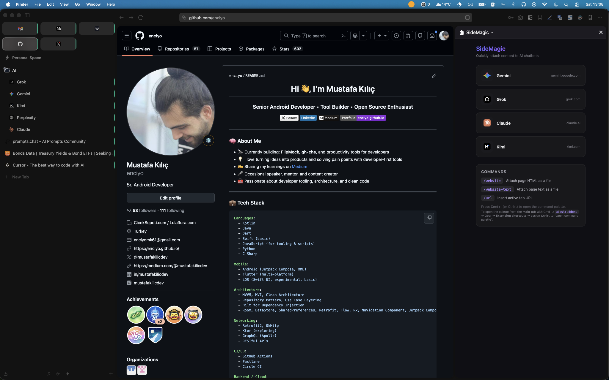
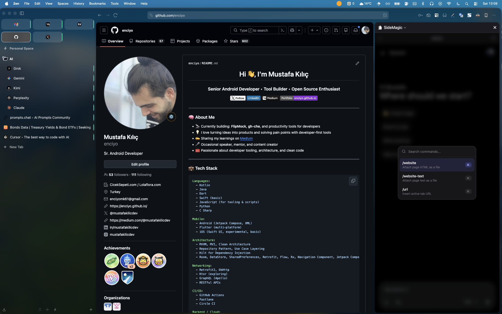
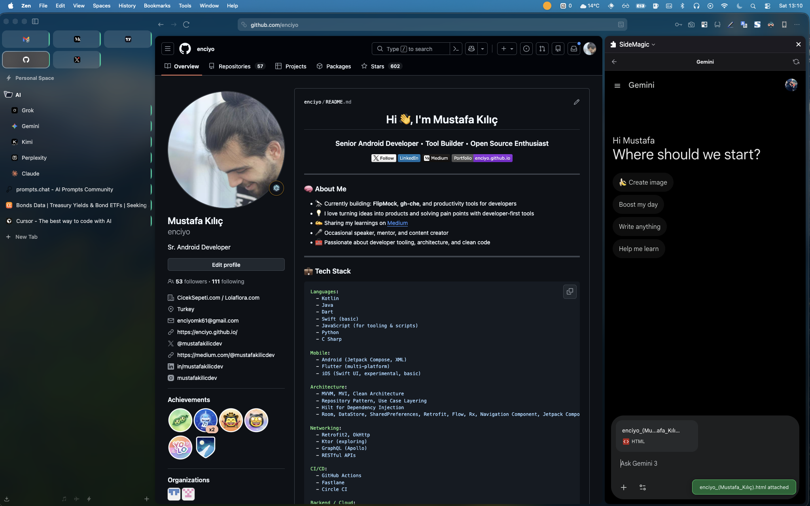
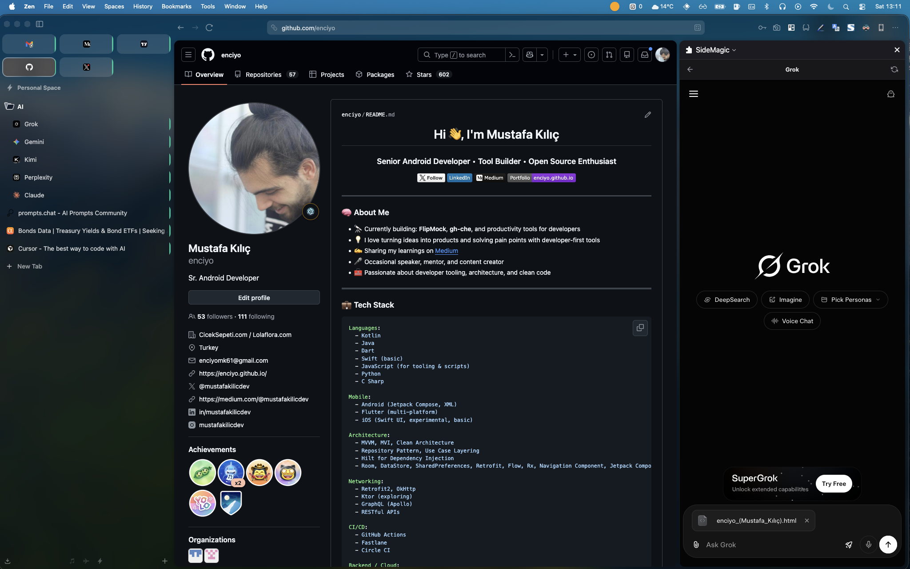

<p align="center">
  
</p>

<h1 align="center">SideMagic</h1>

<p align="center">
  <strong>Attach website content to AI chatbots as files — right from your browser's side panel.</strong>
</p>

<p align="center">
  <a href="#-features">Features</a> •
  <a href="#-supported-chatbots">Supported Chatbots</a> •
  <a href="#-installation">Installation</a> •
  <a href="#-usage">Usage</a> •
  <a href="#-commands">Commands</a> •
  <a href="#-development">Development</a> •
  <a href="#-türkçe">Türkçe</a>
</p>

<p align="center">
  
  
  
  
</p>

---

## 🌐 English

### ✨ Features

- **Side Panel Chatbots** — Open AI chatbots (Gemini, Grok, Claude, Kimi) directly in the browser side panel
- **Attach Page Content** — Send the current page's HTML or text to any chatbot as a file attachment
- **Command Palette** — Quick access to all commands with `Cmd+.` (or `Ctrl+.`)
- **Slash Commands** — Type commands directly in the chatbot input field
- **Multi-language** — English and Turkish support
- **Cross-browser** — Works on Chrome (MV3) and Firefox (MV2)

### 🤖 Supported Chatbots

| Chatbot | Domain | File Attach |
|---------|--------|:-----------:|
| **Gemini** | gemini.google.com | ✅ |
| **Grok** | grok.com / x.com | ✅ |
| **Claude** | claude.ai | ✅ |
| **Kimi** | kimi.com | ✅ |

### 📦 Installation

#### Chrome Web Store
[Link](https://chromewebstore.google.com/detail/jpfjjonpenccbiokoedbgkfegobfdjif?utm_source=item-share-cb)

#### Firefox Add-ons
[Link](https://addons.mozilla.org/en-US/firefox/addon/sidemagic/)

#### Manual Installation (Developer Mode)

**Chrome:**
1. Run `npm run build` to build the extension
2. Open `chrome://extensions/`
3. Enable **Developer mode** (top right)
4. Click **Load unpacked**
5. Select the `.output/chrome-mv3` folder

**Firefox:**
1. Run `npm run build:firefox` to build the extension
2. Open `about:debugging#/runtime/this-firefox`
3. Click **Load Temporary Add-on**
4. Select any file in the `.output/firefox-mv2` folder

### 🚀 Usage

1. **Open the Side Panel** — Click the SideMagic icon in the toolbar (or use the browser's side panel menu)
2. **Select a Chatbot** — Click on any chatbot card (Gemini, Grok, Claude, Kimi)
3. **Navigate to a Page** — Open any website in the main browser tab
4. **Attach Content** — Use the command palette (`Cmd+.`) or slash commands to attach content

### 📸 Screenshots

<p align="center">
  
  &nbsp;&nbsp;
  
  &nbsp;&nbsp;
  
</p>

<p align="center">
  
  &nbsp;&nbsp;
  
</p>

### ⌨️ Commands

| Command | Shortcut | Description |
|---------|----------|-------------|
| `/website` | `Cmd+.` → Select | Attach page HTML as a file |
| `/website-text` | `Cmd+.` → Select | Attach page text as a file |
| `/url` | `Cmd+.` → Select | Insert active tab URL into chat |

### 🔧 How It Works

1. **Side Panel** loads chatbot sites inside an iframe
2. **Content Script** injects into chatbot pages to handle file attachment
3. **Background Script** manages tab tracking, source tab data, and file interception
4. **Main World Script** intercepts native file inputs for seamless attachment
5. **Command Palette** communicates with content script via `postMessage`

### 🔒 Permissions

| Permission | Why |
|------------|-----|
| `activeTab` | Access the current tab's content |
| `tabs` | Track which tab is the "source" page |
| `storage` | Save command palette state |
| `identity` | Handle authentication for embedded chatbots |
| `webNavigation` | Detect page navigation for auth flow |
| `scripting` (Chrome) | Inject content scripts |
| `declarativeNetRequest` (Chrome) | Remove X-Frame-Options headers for iframe embedding |
| `webRequest` + `webRequestBlocking` (Firefox) | Same as above, for Firefox MV2 |

---

## 🇹🇷 Türkçe

### ✨ Özellikler

- **Yan Panel Chatbot'lar** — AI chatbot'ları (Gemini, Grok, Claude, Kimi) doğrudan tarayıcının yan panelinde açın
- **Sayfa İçeriği Ekleme** — Mevcut sayfanın HTML veya metin içeriğini herhangi bir chatbot'a dosya olarak gönderin
- **Komut Paleti** — `Cmd+.` (veya `Ctrl+.`) ile tüm komutlara hızlı erişim
- **Slash Komutları** — Chatbot giriş alanına doğrudan komut yazın
- **Çoklu Dil** — Türkçe ve İngilizce destek
- **Çapraz Tarayıcı** — Chrome (MV3) ve Firefox (MV2) üzerinde çalışır

### 🤖 Desteklenen Chatbot'lar

| Chatbot | Domain | Dosya Ekleme |
|---------|--------|:------------:|
| **Gemini** | gemini.google.com | ✅ |
| **Grok** | grok.com / x.com | ✅ |
| **Claude** | claude.ai | ✅ |
| **Kimi** | kimi.com | ✅ |

### 📦 Kurulum

#### Chrome Web Mağazası
[Link](https://chromewebstore.google.com/detail/jpfjjonpenccbiokoedbgkfegobfdjif?utm_source=item-share-cb)

#### Firefox Eklentileri
[Link](https://addons.mozilla.org/en-US/firefox/addon/sidemagic/)

#### Manuel Kurulum (Geliştirici Modu)

**Chrome:**
1. `npm run build` komutuyla eklentiyi derleyin
2. `chrome://extensions/` adresini açın
3. Sağ üstten **Geliştirici modu**'nu etkinleştirin
4. **Paketlenmemiş öğe yükle**'ye tıklayın
5. `.output/chrome-mv3` klasörünü seçin

**Firefox:**
1. `npm run build:firefox` komutuyla eklentiyi derleyin
2. `about:debugging#/runtime/this-firefox` adresini açın
3. **Geçici Eklenti Yükle**'ye tıklayın
4. `.output/firefox-mv2` klasöründeki herhangi bir dosyayı seçin

### 🚀 Kullanım

1. **Yan Paneli Açın** — Araç çubuğundaki SideMagic simgesine tıklayın (veya tarayıcının yan panel menüsünü kullanın)
2. **Chatbot Seçin** — Herhangi bir chatbot kartına tıklayın (Gemini, Grok, Claude, Kimi)
3. **Bir Sayfaya Gidin** — Ana tarayıcı sekmesinde herhangi bir web sitesini açın
4. **İçerik Ekleyin** — Komut paleti (`Cmd+.`) veya slash komutlarını kullanarak içerik ekleyin

### 📸 Ekran Görüntüleri

<p align="center">
  
  &nbsp;&nbsp;
  
  &nbsp;&nbsp;
  
</p>

<p align="center">
  
  &nbsp;&nbsp;
  
</p>

### ⌨️ Komutlar

| Komut | Kısayol | Açıklama |
|-------|---------|----------|
| `/website` | `Cmd+.` → Seç | Sayfanın HTML'ini dosya olarak ekle |
| `/website-text` | `Cmd+.` → Seç | Sayfanın metnini dosya olarak ekle |
| `/url` | `Cmd+.` → Seç | Aktif sekmenin URL'ini sohbete ekle |

### 🔧 Nasıl Çalışır

1. **Yan Panel** chatbot sitelerini iframe içinde yükler
2. **Content Script** chatbot sayfalarına enjekte olur ve dosya eklemeyi yönetir
3. **Background Script** sekme takibi, kaynak sekme verisi ve dosya engellemeyi yönetir
4. **Main World Script** sorunsuz dosya ekleme için native dosya girdilerini yakalar
5. **Komut Paleti** content script ile `postMessage` üzerinden iletişim kurar

### 🔒 İzinler

| İzin | Neden |
|------|-------|
| `activeTab` | Mevcut sekmenin içeriğine erişim |
| `tabs` | Hangi sekmenin "kaynak" sayfa olduğunu takip |
| `storage` | Komut paleti durumunu kaydetme |
| `identity` | Gömülü chatbot'lar için kimlik doğrulama |
| `webNavigation` | Kimlik doğrulama akışı için sayfa yönlendirmelerini tespit |
| `scripting` (Chrome) | Content script enjeksiyonu |
| `declarativeNetRequest` (Chrome) | iframe gömme için X-Frame-Options başlıklarını kaldırma |
| `webRequest` + `webRequestBlocking` (Firefox) | Yukarıdakinin aynısı, Firefox MV2 için |

---

## 🛠️ Development

### Prerequisites

- **Node.js** ≥ 18
- **npm** ≥ 9

### Setup

```bash
# Install dependencies
npm install

# Development (Chrome)
npm run dev

# Development (Firefox)
npm run dev:firefox
```

### Build

```bash
# Build for Chrome (MV3)
npm run build

# Build for Firefox (MV2)
npm run build:firefox

# Package as ZIP (for store submission)
npm run zip          # Chrome
npm run zip:firefox  # Firefox
```

### Project Structure

```
SideMagic/
├── entrypoints/
│   ├── background.ts              # Service worker / background script
│   ├── content.ts                  # Content script (injected into chatbot pages)
│   ├── intercept-main-world.ts     # Main world script for file input interception
│   ├── shortcut-hint.content.ts    # Shortcut hint overlay
│   └── sidepanel/
│       ├── index.html              # Side panel UI
│       ├── main.ts                 # Side panel logic
│       └── style.css               # Side panel styles
├── public/
│   ├── _locales/
│   │   ├── en/messages.json        # English translations
│   │   └── tr/messages.json        # Turkish translations
│   ├── chatbot-icons/
│   │   ├── gemini.svg
│   │   ├── grok.svg
│   │   ├── claude.svg
│   │   └── kimi.svg
│   ├── icon-16.png                 # Extension icon 16x16
│   ├── icon-32.png                 # Extension icon 32x32
│   ├── icon-48.png                 # Extension icon 48x48
│   ├── icon-96.png                 # Extension icon 96x96
│   └── icon-128.png                # Extension icon 128x128
├── utils/
│   ├── constants.ts                # Shared constants
│   ├── dom-helpers.ts              # DOM utility functions
│   ├── i18n.ts                     # i18n helper
│   ├── identity-auth.ts            # Identity/auth helpers
│   ├── site-config.ts              # Per-site CSS selectors & config
│   ├── slash-menu.ts               # Command definitions
│   ├── toast.ts                    # Toast notification utility
│   ├── types.ts                    # Shared TypeScript types
│   ├── background/
│   │   ├── command-palette.ts      # Command palette logic (background)
│   │   ├── file-intercept.ts       # File interception handler
│   │   ├── source-tab-data.ts      # Source tab data management
│   │   └── tab-tracking.ts         # Tab tracking & side panel association
│   ├── file-attach/
│   │   ├── index.ts                # File attachment entry point
│   │   ├── helpers.ts              # Attachment helpers
│   │   ├── strategy-direct.ts      # Direct file input strategy
│   │   ├── strategy-drop.ts        # Drag & drop strategy
│   │   ├── strategy-intercept.ts   # Interception strategy
│   │   └── strategy-paste.ts       # Clipboard paste strategy
│   └── frame-embedding/
│       ├── auth-redirect.ts        # Auth redirect handling for iframes
│       ├── constants.ts            # Frame embedding constants
│       └── header-removal.ts       # X-Frame-Options header removal
├── wxt.config.ts                   # WXT configuration
└── package.json
```

---

## 📄 License

MIT

---
